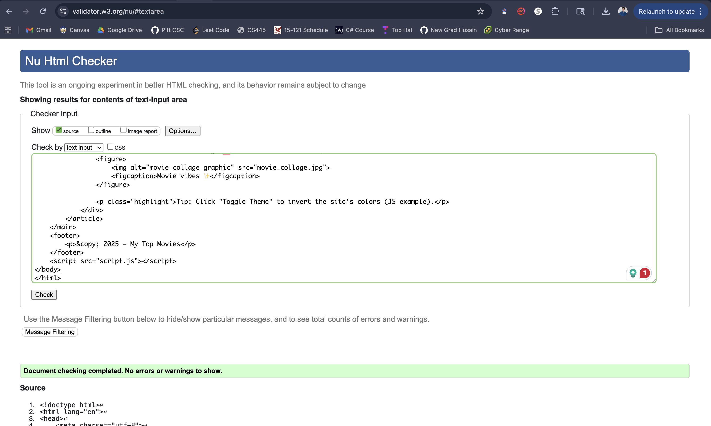
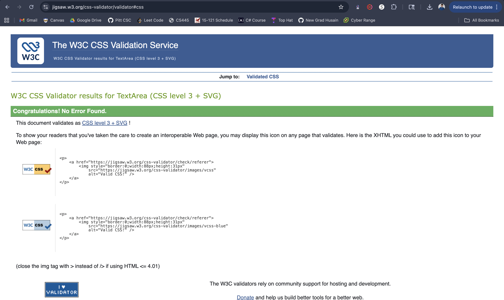

# luc59_assignment1

### I made an informational website about the movies I liked. I chose this kind of website as it gives the users many different options of how they would like to interact with the site

1. `index.html`: Home page with a movie collage image and basic info about the site.
2. `movies.html`: List of my top 5 favorite movies with info about the movies and why I like them.
3. `genres.html`: Movies listed by genre.
4. `blog.html`: A mini blog section with two posts about my love for movies.
5. `contact.html`: A contact form for user's to interact with my site and provide feedback.

### HTML Elements Used and Why
- Semantic: `<header>`, `<nav>`, `<main>`, `<article>`, `<section>`, `<footer>`.
- Lists: ordered `<ol>` and unordered `<ul>`.
- Table: `<table>`, `<thead>`, `<tbody>`, `<tr>`, `<th>`, `<td>`.
- Media: Used `` to place an image on the page.
- Form elements: `<form>`, `<input>`, `<textarea>`, `<button>`.
- Decorative: `
`, `` and other classed elements for styling.

### CSS Used
- I created a single `styles.css` used across all the 5 pages.
- It includes layout changes (centered container, nav as horizontal list), text style, link pseudo-class (`a:visited`), table styling, and a dark theme toggled by JS (`body.dark`).

### JavaScript Used
- `toggleTheme()` toggles the `.dark` class on `<body>` to invert the site's colors.
- `toggleListExtra()` toggles visibility of the last two items in the top-5 list.
- Event listeners:
  - `#themeToggle` button → toggle theme.
  - `#toggleListBtn` → show/hide list items.
  - `#sendBtn` → “sends” the contact form contents and reveals a status paragraph.
